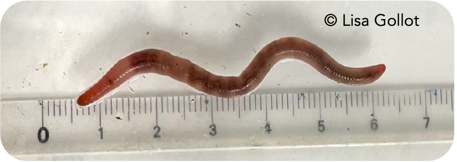

```{r, include=F}
library(here)
source(file = here::here("functions/fun.R"))
f_load_libraries_colors()
```

# Earthworms and pesticides

## Earthworms used in this study {#sec-A}

### Earthworm model - *Aporrectodea caliginosa*

*Aporrectodea caliginosa* (@fig-cali), an endogeic earthworm species, was the chosen biological model for it is considered highly representative of agricultural soil [@bart_2018] and is part of the most sensitive agricultural species to pesticides [@pelosi_2013]. It is also a species we are able to cultivate under laboratory conditions (@sec-earthwormsbreeding).

{#fig-cali width="50%"}

#### Earthworm cultivation at EcoSys {#sec-earthwormsbreeding}

A further objective of this study is to evaluate the effects of a pesticides mixture on inter-individual variations of life-history traits and behavior of *A. caliginosa*. To achieve this, it is essential to use individuals whose genetic diversity is representative of a natural population with limited exposure to plant protection products (PPPs). This excludes the use of the breeding stock maintained at EcoSys, as the individuals have been kept in a closed system since the initiation of the breeding program (for over 5 years), with no consideration for maintaining genetic diversity. Therefore, it was necessary to establish a new *A. caliginosa* breeding population appropriate for the scientific questions addressed in this study.

#### Initially collected individuals.

To initiate the culture, individuals were collected from a natural population in a permanent grassland in Versailles (48°48′ N, 2°5′ E, called "les Closeaux") where no pesticides have been applied for more than 25 years (@fig-terrain). The individuals were identified using a binocular microscope and an identification key. Ten sampling sessions were conducted in the fall of 2023 and the spring of 2024, yielding a total of 325 individuals.

{#fig-terrain width="50%"}

##### Workflow

Individuals are bred at 18°C in 1 L vessels in groups of five individuals (@fig-terrain) using a loamy soil texture called Closeaux soil (based on the texture definition of the Food and Agriculture Organization of the United Nations (FAO)), sampled from the same meadow as initial individuals. Pesticides found in the soil are summarized in @fig-closeauxPPP and its general properties in @tbl-clx. The soil was collected from the top 0-20 cm, air-dried and crushed to pass a 2 mm mesh. Soil culture is kept with a soil water-holding capacity (WHC) of 60-70%. Individuals are fed with horse dung frost and defrosted twice before being milled (\> 1mm) as presented in @lowe_2005. They are fed each month with the equivalent of around 6 g of dry horse dung which are given with a WHC of 60-70%.

| Characteristics                 | Value |
|:--------------------------------|:------|
| Clay (\< 2 µm, g/kg)            | 226.0 |
| Fine silt (2-20 µm, g/kg)       | 174.1 |
| Coarse silt (20-50 µm, g/kg)    | 298.9 |
| Fine sand (50-200 µm, g/kg)     | 239.1 |
| Coarse sand (200-2000 µm, g/kg) | 47.9  |
| CaCO3 total (g/kg)              | 23.3  |
| Organic matter (g/kg)           | 32.6  |
| P2O5 (g/kg)                     | 0.1   |
| Organic carbon (g/kg)           | 18.9  |
| Total nitrogen (N) (g/kg)       | 1.5   |
| C/N                             | 12.7  |
| pH                              | 7.5   |
| Total Cu (mg/kg)                | 25.2  |

: Closeaux soil characteristics {#tbl-clx .hover}

```{r, warning=F, message=F}
#| fig-cap: Concentrations of pesticides found in the cultivation soil for our earthworms. 
#| label: fig-closeauxPPP
#| fig-width: 8
#| fig-height: 12

col_bar <- Nord_polar[4]

# Data of measured pesticides concentrations in the Closeaux soil 
df_PPPclx <- read_excel(here::here("data/Data_pesticides_closeaux_soil.xlsx"), sheet="Clx") |>
  mutate(Conc = round(C_calc, 2))

# Separation per scale
df_PPPclx <- df_PPPclx |>                                 # <1>
  mutate(Molecule = fct_reorder(Molecule, Conc)) |>       # <1>
  mutate(facet = case_when(Conc <=10 ~ 1,                 # <1>
                           Conc<=100 & Conc>10 ~ 2,       # <1>
                           Conc<=1000 & Conc>100 ~ 3,     # <1>
                           Conc<=10000 & Conc>1000 ~ 4,   # <1>
                           Conc<=100000 & Conc>10000 ~5)) # <1>

df_PPPclx_10 <- df_PPPclx |> subset(facet==1) 
df_PPPclx_100 <- df_PPPclx |> subset(facet==2) 
df_PPPclx_1000 <- df_PPPclx |> subset(facet==3) 
df_PPPclx_10000 <- df_PPPclx |> subset(facet==4) 
df_PPPclx_100000 <- df_PPPclx |> subset(facet==5) 

Size_text <- 10
size_label <- 2
alpha_col <- 0.2

plot_1 <- ggplot(
  data=df_PPPclx_10, 
  aes(
    x=Molecule, 
    y=Conc
    )
  )+
  geom_col(
    color=col_bar, 
    fill=col_bar, 
    alpha=alpha_col
    )+
  geom_text(
    aes(label = round(Conc)), 
    vjust = -0.5, 
    color=col_bar, 
    size=size_label
    )+
  labs(
    x="Pesticides", 
    y="Soil concentration (ng/kg)"
    )+
  theme_bw(Size_text)+
  theme(axis.text.x = element_text(angle = 45, hjust = 1))

plot_2 <- ggplot(
  data=df_PPPclx_100, 
  aes(
    x=Molecule, 
    y=Conc
    )
  )+
    annotate(
      geom="rect", 
      xmin="atrazine-desisopropyl", 
      xmax="carbendazin", 
      ymin=0, 
      ymax=95, 
      color=col_EPX,
      fill=col_EPX,
      alpha=0.2, 
      size=1.2
      )+
  annotate(
    geom="rect", 
    xmin="Flusilazole", 
    xmax="fluopyram", 
    ymin=0, 
    ymax=22, 
    color=col_IMD, 
    alpha=0.2, 
    fill=col_IMD, 
    size=1.2
    )+
  geom_col(
    color=col_bar, 
    fill=col_bar, 
    alpha=alpha_col
    )+
  geom_text(
    aes(label = round(Conc)), 
    vjust = -0.5, 
    color=col_bar, 
    size=size_label
    )+
  labs(
    x="Pesticides", 
    y="Soil concentration (ng/kg)"
    )+
  ylim(0,100)+
  theme_bw(Size_text)+
  theme(axis.text.x = element_text(angle = 45, hjust = 1))

plot_3 <- ggplot(
  data=df_PPPclx_1000, 
  aes(
    x=Molecule, 
    y=Conc
    )
  )+
  geom_col(
    color=col_bar, 
    fill=col_bar, 
    alpha=alpha_col
    )+
  geom_text(
    aes(label = round(Conc)), 
    vjust = -0.5, 
    color=col_bar, 
    size=size_label
    )+
  labs(
    x="Pesticides", 
    y="Soil concentration\n (ng/kg)"
    )+
  theme_bw(Size_text)+
  theme(axis.text.x = element_text(angle = 45, hjust = 1))

plot_4 <- ggplot(
  data=df_PPPclx_10000, 
  aes(
    x=Molecule, 
    y=Conc
    )
  )+
  geom_col(
    color=col_bar, 
    fill=col_bar, 
    alpha=alpha_col
    )+
  geom_text(
    aes(label = round(Conc)), 
    vjust = -0.5, 
    color=col_bar, 
    size=size_label
    )+
  labs(
    x="Pesticides", 
    y="Soil concentration\n (ng/kg)"
    )+
  theme_bw(Size_text)+
  theme(axis.text.x = element_text(angle = 45, hjust = 1))

plot_5 <- ggplot(
  data=df_PPPclx_100000,
  aes(
    x=Molecule, 
    y=Conc
    )
  )+
  geom_col(
    color=col_bar, 
    fill=col_bar, 
    alpha=0.4
    )+
  geom_text(
    aes(label = round(Conc)), 
    vjust = -0.5, 
    color=col_bar, 
    size=size_label
    )+
  labs(
    x="Pesticides", 
    y="Soil concentration\n (ng/kg)"
    )+
  theme_bw(Size_text)+
  theme(axis.text.x = element_text(angle = 45, hjust = 1))

#plot
grid.arrange(plot_1, plot_2, plot_3, plot_4, plot_5,
             ncol=3, 
             layout_matrix = cbind(
               c(1,1,2,2), 
               c(1,1,2,2), 
               c(1,1,3,4), 
               c(1,1,3,5)
               )
             )

```

1.  Division of the pesticides in groups of similar concentration levels.

```{r, warning=F, message=F, include=F}
#| fig-cap: Concentrations of pesticides found in the cultivation soil for our earthworms. 
#| label: fig-closeauxPPPfr
#| fig-width: 8
#| fig-height: 12

col_bar <- Nord_polar[4]

# Data of measured pesticides concentrations in the Closeaux soil 
df_PPPclx <- read_excel(here::here("data/Data_pesticides_closeaux_soil.xlsx"), sheet="Clx") |>
  mutate(Conc = round(C_calc, 3))

# Separation per scale
df_PPPclx <- df_PPPclx |>                                 # <1>
  mutate(Molecule = fct_reorder(Molecule, Conc)) |>       # <1>
  mutate(facet = case_when(Conc <=10 ~ 1,                 # <1>
                           Conc<=100 & Conc>10 ~ 2,       # <1>
                           Conc<=1000 & Conc>100 ~ 3,     # <1>
                           Conc<=10000 & Conc>1000 ~ 4,   # <1>
                           Conc<=100000 & Conc>10000 ~5)) # <1>

df_PPPclx_found <- df_PPPclx |> 
  filter(Conc > 1)

Size_text <- 10
size_label <- 2
alpha_col <- 0.2

p <- ggplot(
  data=df_PPPclx_found, 
  aes(
    x=Molecule, 
    y=Conc
    )
  )+
  annotate(
      geom="rect", 
      xmin="atrazine-desisopropyl", 
      xmax="carbendazin", 
      ymin=0, 
      ymax=95, 
      color=col_EPX,
      fill=col_EPX,
      alpha=0.2, 
      size=0.5
      )+
  annotate(
    geom="rect", 
    xmin="Flusilazole", 
    xmax="fluopyram", 
    ymin=0, 
    ymax=22, 
    color=col_IMD, 
    alpha=0.2, 
    fill=col_IMD, 
    size=0.5
    )+
  geom_col(
    color=col_bar, 
    fill=col_bar, 
    alpha=alpha_col
    )+
  geom_text(
    aes(label = signif(Conc,2)), 
    vjust = -0.5, 
    color=col_bar, 
    size=size_label
    )+
  scale_y_log10() +
  labs(
    x     = "", 
    y     = "Concentration dans le sol (ng/kg)"
    )+
  theme_bw(Size_text)+
  theme(axis.text.x = element_text(angle = 45, hjust = 1))


```

#### DNA barcoding

As *A. caliginosa* is a complex of species, DNA barcoding was perform on 10 individuals from each culture (original culture and our new culture). The results summarized by @fig-resbarcoding show the existence of individuals from two different lineages in both cultures.

PARLER IMPLICATION POUR NOUS

{#fig-resbarcoding}

## Pesticides of interest

Because our aim was to study a mixture of pesticides representative of earthworm exposure in agricultural soils, a crucial step of the study was to select two relevant pesticides.

### Choice of Epoxiconazole and Imidacloprid

The selection was made in fall 2023 and was guided by two main criteria: the ubiquity and persistence of pesticide residues in soils, and the availability of ecotoxicological data on earthworms.

@froger_2023 conducted an extensive nationwide survey of pesticide contamination in French soils, monitoring 111 pesticide residues across 47 sites under various land uses. Epoxiconazole and imidacloprid were detected in 47% and 9% of all sites, respectively, with median concentrations of 5.8 ng/g and 2.9 ng/g, and maximum concentrations of 23.6 ng/g and 13.8 ng/g. In arable lands, epoxiconazole, bixafen, fluopyram, fluxapyroxad, glyphosate & AMPA, diflufenican, and terfluthrin were among the most frequently detected compounds.

In a complementary study, @pelosi_2021a investigated the exposure of earthworms to 31 pesticide residues in both treated and untreated habitats within an intensive agricultural landscape in France (Spring 2016, Long-Term Socio-Ecological Research Site, Zone Atelier Plaine & Val de Sèvre). Diflufenican, imidacloprid, boscalid, and epoxiconazole were among the most frequently detected residues, found in more than 80% of sampled soils.

Based on these two studies, we initially targeted a range of pesticide residues. Ultimately, we selected epoxiconazole and imidacloprid due to the availability of toxicological data and their known effects on earthworms [@bart_2020a; @bart_2019c; @pelosi_2016; @capowiez_2006; @dittbrenner_2011; @dittbrenner_2010; @vanloon_2022; @wang_2019]. Despite being now banned in the EU, both pesticides continue to be of concern due to their ubiquity and persistence in the environment. These pesticides have been shown to persist in agricultural soils, with concentrations that can still pose adverse effects on non-target organisms, such as earthworms. Imidacloprid is particularly known for impairing earthworm bioturbation, a critical process that supports many ecosystem functions [@chen_2021]. Both pesticides' enduring presence in the environment highlights the relevance of studying their long-term ecological impacts. This choice aligns with the objectives of the EEWORM ANR project, which aims to investigate the eco-evolutionary dynamics of earthworms under pesticide exposure and the resulting impacts on ecosystem functions.

```{r, echo=F, warning=F}
#| label: tbl-chemprop
#| tbl-cap: Physico-chemical properties of epoxiconazole and imidacloprid (data from PPDB).

molec <- c("EPX", "IMD")
CAS <- c("133855-98-8", "138261-41-3")
Solubility_w <- c(6.63, 610) # mg/L
logKow <- c("3.3 (high)", "0.57 (low)")
Henry_law <- c("1.649e-05 (non-volatile)", "1.7e-10 (non-volatile)") 

DT50_lab <- c(353.5,187) # d at 20°C
BCF <- c(70, NA)
NOEC_repro <- c(3.24, 0.178)
LC50 <- c(">500", 10.7)

df_chem_prop <- data.frame(
  molec=molec,
  CAS=CAS,
  Solubility_w=Solubility_w,
  logKow = logKow,
  Henry_law=Henry_law,
  DT50_lab=DT50_lab, 
  BCF=BCF,
  NOEC_repro = NOEC_repro,
  LC50 = LC50,
  stringsAsFactors = FALSE
)

colnames(df_chem_prop) <- c("Molecule",
                            "CAS number", 
                            "Solubility in water (mg/L, 20°C)", 
                            "logKow", 
                            "Henry law", 
                            "DT~50~ (d, lab at 20°C)", 
                            "BCF", 
                            "NOEC (reproduction)", 
                            "LC~50~")

df_chem_prop_t <- as.data.frame(t(df_chem_prop))

df_chem_prop_t <- df_chem_prop_t %>%
  tibble::rownames_to_column(var = "Property") |> 
  filter(!(Property == "Molecule"))
colnames(df_chem_prop_t) <- c("Property", "EPX", "IMD")

df_chem_prop_t |> 
  kable()

```

### Epoxiconazole (EPX)

Epoxiconazole (EPX) is a broad-spectrum fungicide from the azole family, used to control plant diseases caused by Ascomycetes, Basidiomycetes, and Deuteromycetes [@lewis_2006]. It was commercialized by BASF SE in 1993 and applied to a variety of crops including cereals, soy, bananas, rice, coffee, beets, and turnips [@lewis_2006]. Epoxiconazole has also been investigated for medical applications due to its antifungal properties, although its primary use has remained agricultural [@hamdi_2022].

In France, EPX was widely applied on cultivated land, primarily as a foliar treatment. Before its withdrawal, approximately 200 tons were sold annually. Its market authorization was revoked by ANSES in 2019, and subsequently at the EU level in 2020.

Epoxiconazole is a sterol biosynthesis inhibitor (SBI) [@lewis_2006]. It disrupts fungal metabolism by inhibiting mycelial growth, reducing conidia production, and limiting mycotoxin synthesis. Like other triazole fungicides, its main mode of action is the inhibition of cytochrome P450 14α-demethylase (CYP51), a key enzyme in the biosynthesis of sterols such as ergosterol [@vandenbossche_1990; @zarn_2003]. Ergosterol is an essential component of fungal cell membranes, and its disruption compromises fungal viability.

Beyond its antifungal activity, EPX has been shown to interact with endocrine pathways. It acts as an androgen receptor agonist and promotes the synthesis of sex steroid hormones in vitro, which can interfere with developmental processes and individual growth [@kjaerstad_2010; @zarn_2003]. EPX also showed to be carcinogenic on rats. EPX is therefore considered as a reprotoxic and a suspected carcenogenic [@echa_2025b].

The half-life of epoxiconazole is 353.5 days in soil (20°C), 103.4 days in water-sediment (20°C) and 1000 days in water only (20°C) [@lewis_2006], which makes it a very persistant substance in the environment. Its logK$_{ow}$ above 3 makes it likely to bind to the organic matter in soil. Overall, there is broad agreement in that this substance is Persistent, Bioaccumulative and Toxic (PBT) [@echa_2025b].

On earthworms, epoxiconazole impacts growth, maturation and reproduction [@bart_2020a; @bart_2019c]. In field studies, it was shown to reduce the species diversity, anecic abundance and total biomass [@amosse_2020].

```{r}
#| tbl-cap: Overview of available ecotoxicological data on epoxiconazole (non exhaustive)
#| label: tbl-EPXtox

df_EPX_tox <- data.frame(
  Species = c(
    "Fish",
    "Fish",
    "Aquatic invertebrates - *D. magna*",
    "Aquatic invertebrates - *D. magna*",
    "Algae",
    "Earthworm - *E. fetida*",
    "Earthworm - *E. fetida*"
    ),
  Endpoint = c(
    "LC50 (96 h)",
    "NOEC (reproduction, 90 d)",
    "EC50 (48 h)",
    "NOEC (reproduction, 21 days)",
    "OECD TG 201 - EC50 (growth inhibition, 72 h)",
    "Acute LC50 (14 d)",
    "ISO 11268-2 - NOEC (reproduction, 56 d)"
    ),
  Value = c(
    "3.2 mg/L",
    "0.01 mg/kg",
    "8.9 mg/kg",
    "0.63 mg/L",
    "6.7 g/L",
    "> 500 mg/kg",
    "> 3.24 mg/kg"
    )
)
kable(df_EPX_tox)
```

### Imidacloprid (IMD)

Imidacloprid (IMD) is a systemic insecticide belonging to the chloronicotinyl (neonicotinoid) family. It is widely used in agriculture across the globe to control sap-feeding insects such as plant hoppers, aphids, termites, Colorado potato beetles, fleas, white grubs, craneflies, crickets, and ants [@lewis_2006]. Its applications included lawns and turf, as well as crops such as rice, cereals, maize, potatoes, and sugar beet. It was also used in veterinary medicine, notably in flea treatments for domestic pets. Imidacloprid was commercialized by Bayer in 1991 [@lewis_2006].

In France, the use of neonicotinoids — including imidacloprid — was progressively restricted following the adoption of the 2016 law on the “reconquest of biodiversity, nature and landscapes” (loi pour la reconquête de la biodiversité, de la nature et des paysages). The European Union withdrew the market authorization for imidacloprid in 2020. Currently, only acetamiprid remains approved for use in France and the EU, primarily for veterinary purposes. A temporary derogation had allowed the use of imidacloprid and thiamethoxam for aphid-infested beet crops, but this exemption was definitively revoked in January 2023, reinforcing the ban on neonicotinoids following multiple regulatory actions at both French and European levels [@anses_2020].

Imidacloprid exerts its toxic effects by acting as an agonist of the nicotinic acetylcholine receptors (nAChRs), leading to overstimulation and subsequent disruption of the central nervous system in target invertebrates [@lewis_2006; @chen_2021]. This mechanism makes it highly effective at low concentrations, but also raises concerns about its non-target effects, particularly on soil invertebrates such as earthworms.

Imidacloprid is also under assessment for endocrine disrupting [@echa_2025b].

The half-life of imidacloprid is 2.3 years in fresh water (12°C), 1.1 years in freshwater-sediment (12°C) and 1.4 years in soil (12°C) [@lewis_2006], which makes it a very persistant substance in the environment.

On earthworms, imidacloprid significatively impacts survival but also growth, maturation and reproduction [@vanloon_2022; @pelosi_2016; @dittbrenner_2011]. It was also shown to disturbe activities of carboxylesterase (CarE) and glutathione-S- transferases (GST) [@wang_2019]. More importantly, it affects earthworms' burrowing activity, essential for the various ecosystem functions endorsed by earthworms [@capowiez_2006; @dittbrenner_2010].

```{r}
#| tbl-cap: Overview of available ecotoxicological data on imidacloprid (non exhaustive)
#| label: tbl-IMDtox

df_IMD_tox <- data.frame(
  Species = c(
    "Fish - *C. variegatus*", 
    "Fish - *O. mykiss*", 
    "Aquatic invertebrates - *D. magna*", 
    "Aquatic invertebrates - *D. magna*", 
    "Algae - *S. capricornutum*", 
    "Earthworm - *E. fetida*",
    "Earthworm - *E. fetida*",
    "Collembole - *F. candida*",
    "Bird - *C. virginianus*"
    ),
  Endpoint = c(
    "EPA OPP 72-1 - LC50 (96 h)", 
    "OECD TG 210 - NOEC (reproduction, 31 days)", 
    "EPA OPP 72-2 - EC50 (immobilization, 48 h)", 
    "EPA OPP 72-4 - NOEC (reproduction, 21 days)", 
    "OECD TG 201 - EC50 (growth inhibition, 72 h)",
    "ISO 11268-2 - NOEC (reproduction, 56 d)",
    "OECD TG 207 - LC50 (14 d)",
    "ISO/FDIS 11267(1998) - NOEC (reproduction, 28 d)",
    "EPA OPP Guideline 71-4 - NOEC (reproduction, 20 wk)"
    ),
  Value = c(
    "161 mg/L", 
    "> 9.02 mg/L", 
    "85 mg/L", 
    "1.8 mg/L", 
    "> 100 mg/L",
    "> 178 µg/kg",
    "10.7 mg/kg",
    "1.25 mg/kg",
    "126 mg/kg diet"
    )
)
kable(df_IMD_tox)
```

### Environmental concentrations

```{r, warning=F, message=F}
df_rescape <- read.csv(here::here("data/Data_Rescape_long.csv")) |> 
  subset(pesticide %in% c("EPX", "IMD"))

df_litt_soils <- read_excel(here::here("data/Data_litt_EPX_IMD.xlsx"), sheet=2)
```
