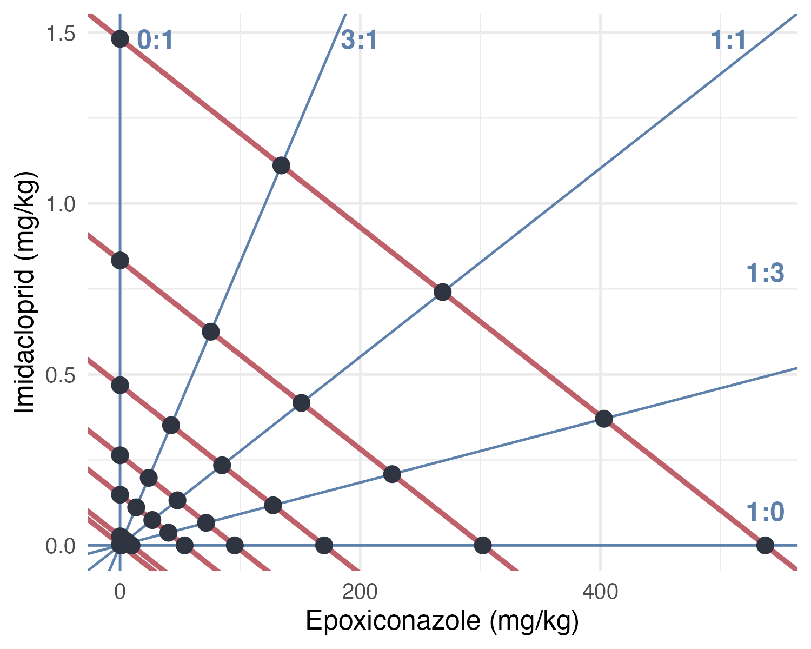

# Toxicokinetics of the mixture - Protocole

## Experiment

Adult earthworms were exposed for 28 days to a range of mixtures of imidacloprid and epoxiconazole varying both in concentration levels and in component ratios. Earthworms were maintained in pairs within experimental cosms containing 200 g of soil and were fed with 3 g of food per individual every 14 days. Body weights were recorded at the start of the exposure, after 14 days, and at the end of the 28-day period. Following exposure, earthworms were transferred to Petri dishes lined with moist filter paper and kept fasting for approximately 24 hours to allow gut clearance. After this depuration phase, individuals were weighed again, sacrificed, and stored at -80 °C for chemical analysis. As for the first experiments, when 24 h was not sufficient to completely clear the gut, individuals were gently massaged to remove the remaining gut contents. Two effect isoboles were tested with five ratios of concentration each : 1:0 (EPX only), 3:1, 1:1, 1:3, 0:1 (IMD only). The first isobole corresponds to concentrations relatively comparable to the exposure concentrations in the single substance experiments (“TK”) while the second corresponds to much higher concentrations (x18).

This experiment took part as a broader experiment on the effect of the mixture on earthworm reproduction. More information [here](https://lisagllt.github.io/Ew-Mix-TD/).

## Simulations

Simulations were conducted using the toxicokinetic models previously calibrated on single-compound exposure experiments to predict internal concentrations of both pesticides in earthworms exposed to mixtures. These simulations assume no interaction between compounds and therefore provide a null expectation based on independent toxicokinetics. Predicted concentrations were compared to experimental data obtained for both single-compound exposures and mixture treatments. In particular, comparisons were performed across the different mixture ratios tested to assess whether co-exposure to epoxiconazole modified the toxicokinetics of imidacloprid. Deviations between model predictions and observed concentrations would be interpreted as evidence of potential toxicokinetic interactions. To account for dilution due to growth, the individual growth rate of each earthworm during the mixture exposure was estimated by linear regression and directly implemented in the model.
