# Earthworm culture

## Breeding and experiment soil

The soil used in the culture of earthworms is collected from the top 10 cm of a meadow in Versailles called "Les Closeaux". It is then dried before being milled at \< 2 mm.

| Characteristics                 | Value |
|---------------------------------|-------|
| Clay ( \< 2 µm, g/kg)           | 226.0 |
| Fine silt (2-20 µm, g/kg)       | 174.1 |
| Coarse silt (20-50 µm, g/kg)    | 298.9 |
| Fine sand (50-200 µm, g/kg)     | 239.1 |
| Coarse sand (200-2000 µm, g/kg) | 47.9  |
| $CaCO_3$ total (g/kg)           | 23.3  |
| Organic matter (g/kg)           | 32.6  |
| $P_2O_5$ (g/kg)                 | 0.1   |
| Organic carbon (g/kg)           | 18.9  |
| Total nitrogen (N) (g/kg)       | 1.5   |
| C/N                             | 12.5  |
| pH                              | 7.5   |
| Total $Cu$ (mg/kg)              | 25.2  |

: Main characteristics of the breeding soil from Versailles. Table from @bart_2017a. {@tbl-Clx}

## DNA barcoding

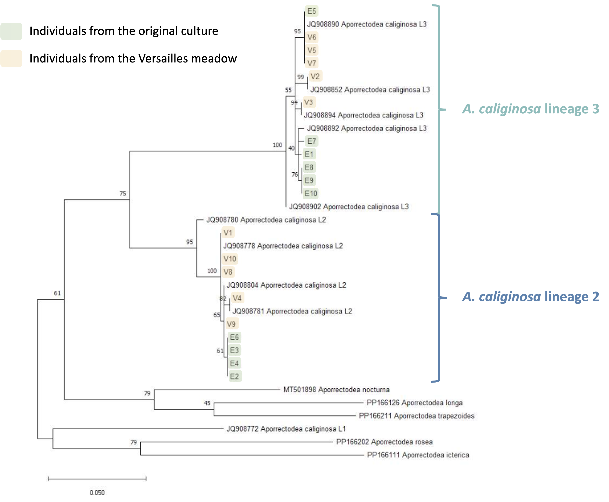

The phylogenetic tree was realised thanks to maximum likelyhood bootstrap method (1000 simulations) with the Tamura-Nei model (nucleotides). Bootstrap frequency is indicated on each branch.

*Aporrectodea caliginosa* is a cryptic species complex comprising three lineages. Our earthworm culture is known to include individuals from two closely related lineages (2 and 3). While these lineages could potentially exhibit differences in sensitivity, previous research on *Gammarus roeselii* has shown that tolerance within cryptic species complexes is not always lineage dependent [@kabus_2024].

# Experiments

## Single substances experiments

### Toxicokinetic experiments (TK & TK BIS experiments)

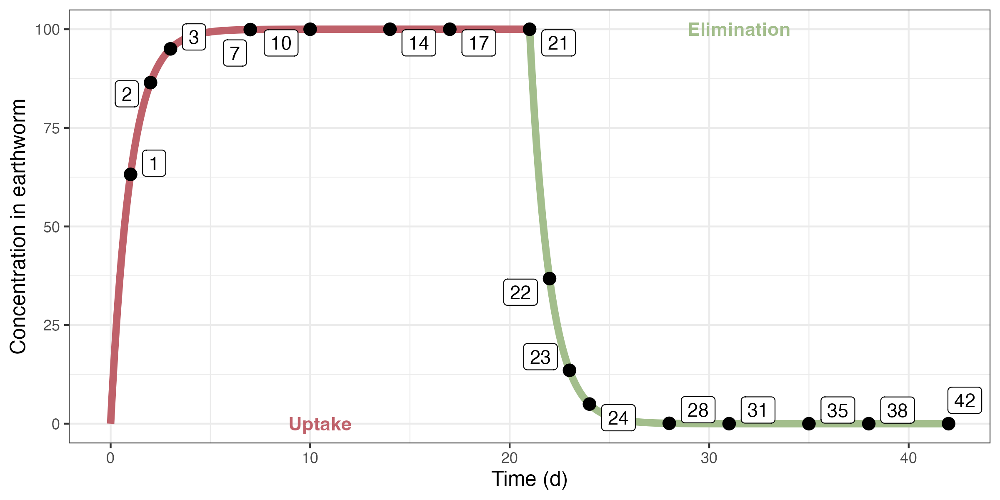

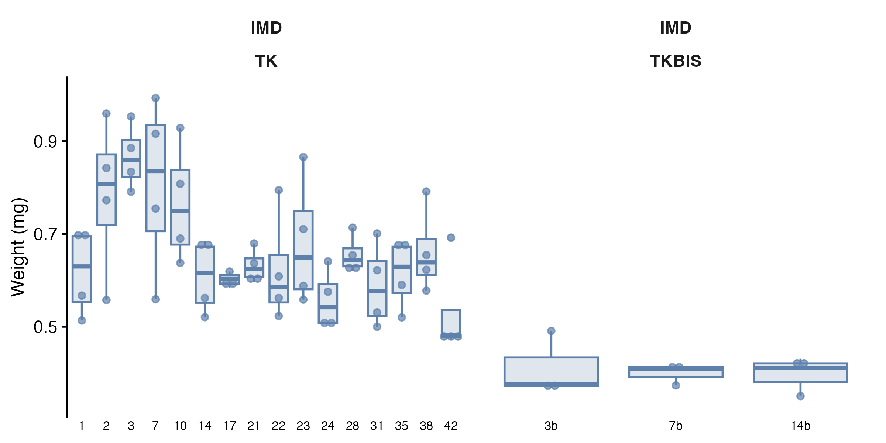

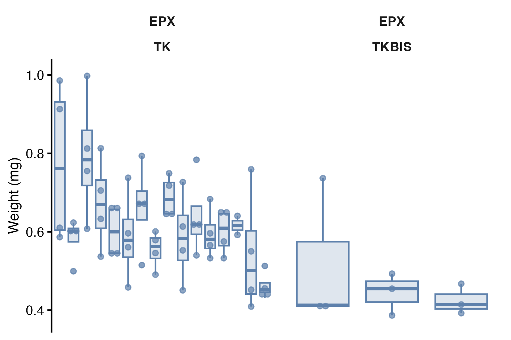

| Molecule     | Min   | 1st Q | Mean  | Median | 3rd Q | Max   | $n$ |
|--------------|-------|-------|-------|--------|-------|-------|-----|
| IMD (TK)     | 474.0 | 565.7 | 662.5 | 635.1  | 711.3 | 993.7 | 64  |
| IMD (TK BIS) | 350.0 | 373.2 | 402.8 | 408.8  | 416.5 | 490.8 | 9   |
| EPX (TK)     | 409.3 | 544.7 | 622.8 | 605.8  | 672.6 | 997.7 | 62  |
| EPX (TK BIS) | 386.7 | 408.0 | 462.9 | 414.4  | 467.4 | 736.7 | 9   |

: Initial weight of earthworms (with gut content, mg) in the toxicokinetic experiments. {#tbl-D0TK}

### Link between weight with and without gut content {#sec-gutcontent}

Since experimental data include weights with and without gut content, we established a quantitative relationship between them to allow conversion and ensure consistency across datasets. The relationship is made with the data from the first toxicokinetic experiments with the weight of the earthworm before and after the 24h in Petri dishes (and massage if needed). We make the assumption that the variation in body weight without gut content is negligeable during the 24 hours. The results are shown @fig-depukin.

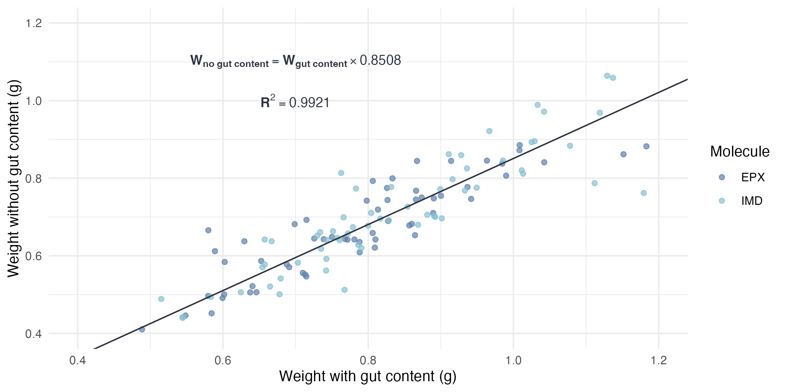{#fig-depukin}

### Depuration kinetic in Pétri dishes (GUT experiment)

Depuration of the earthworm gut content was modeled as a first-order decay (@eq-GUT), informed by a small supporting experiment: ten earthworms were kept individually in 200 g of Closeaux soil with 3 g of horse dung for one week, then transferred to Petri dishes lined with moist filter paper and weighed at regular intervals. After 32 hours, the worms were gently massaged to void the remaining gut contents and weighed again, providing data to estimate the gut-clearance rate.

$$\frac{dP_{Weight}}{dt}=-\frac{\ln 2}{DT_{50,\text{gut}}}\ (P_{Weight}-P^{\infty}_{Weight})$$ {#eq-GUT}

$$P_{Weight}=P^{\infty}_{Weight}+(100-P^{\infty}_{Weight})\ \exp\left(- \frac{\ln 2}{DT_{50,\text{gut}}}\times t\right)$$

With :

-   $t$ : Time (h)
-   $P_{Weight}$ : Percentage of initial weight (%, 0-100)
-   $P^{\infty}_{Weight}$ : Percentage of initial weight when gut is fully emptied (%)
-   $DT_{50,\text{gut}}$ : Half-life of the gut content (h)

For the model, we consider that weights measured after massage are weights measured after a significant amount of time has passed. Therefore, the corresponding percentages of initial weight inform $P^{\infty}_{Weight}$.

The results of the GUT experiment are shown @fig-GUT.

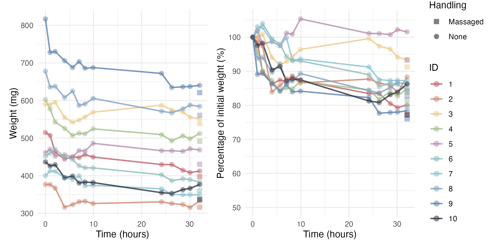{#fig-GUT fig-scap="Evolution of earthworm weight and the corresponding percentage of initial weight throughout time in Petri dishes."}

The estimated value for $DT_{50,\text{gut}}$ and $P^{\infty}_{Weight}$ are 4.37 \[3.11 ; 7.32\] hours and 86.2 \[84.6 ; 87.9\] %, respectively.

$P^{\infty}_{Weight}$ estimated here is consistent with the one estimated in @sec-gutcontent.

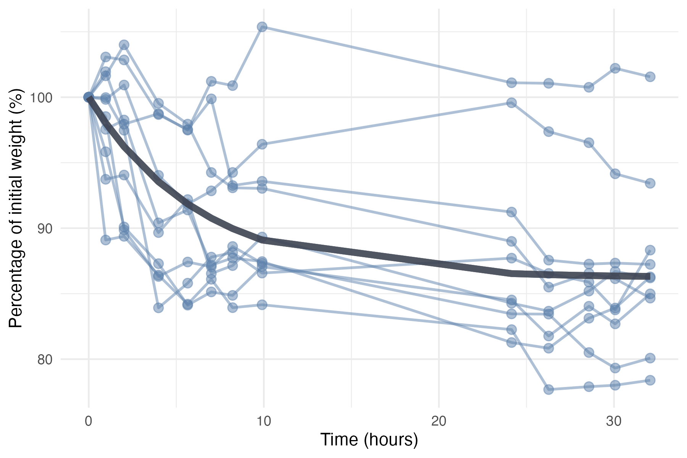{#fig-GUTmod fig-scap="Modeling of the evolution of earthworm percentage of initial weight throughout time in Petri dishes."}

## Mixture experiment

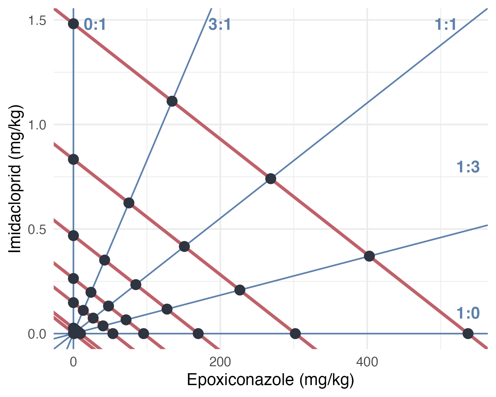{#fig-design fig-scap="Experimental design of the mixture experiment (MIX)."}

Ratio are labeled with letters :

-   E : 1:0 (EPX only)
-   F : 3:1
-   G : 1:1
-   H : 1:3
-   I : 0:1 (IMD only)

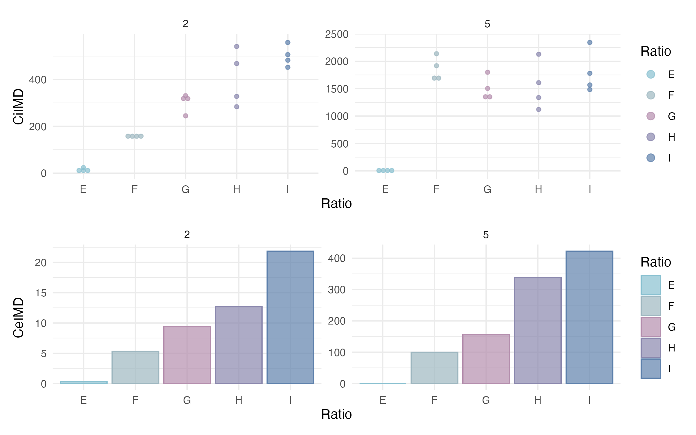

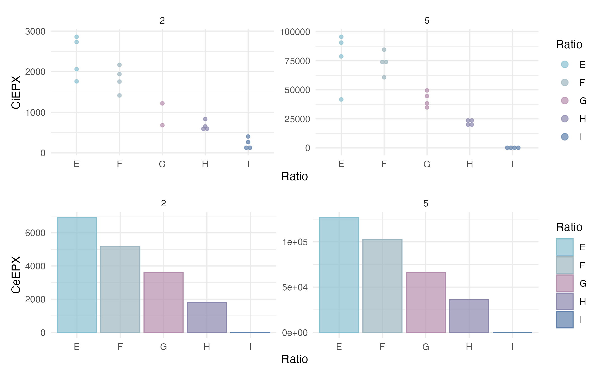

# Toxicokinetics modeling - Single substances

## Priors used

Priors are the same between models :

-   Distrib(kuIMD, LogUniform, 0.0001, 100000); \# min, max
-   Distrib(keIMD, LogUniform, 0.0001, 100000); \# min, max
-   Distrib(kperiph, LogUniform, 0.00001, 100000); \# min, max
-   Distrib(phi, Uniform, 0.0, 1); \# min, max
-   Distrib(a_growth, TruncNormal, 0.005, 0.0010, -0.5, 1); \# mean, sd, min, max
-   Distrib (Vr_a_growth, TruncNormal, 0.0015, 0.01, 0, 1); \# mean, sd, min, max
-   Distrib(Sigma_W, TruncNormal, 0.03, 0.01, 0.0001, 1); \# mean, sd, min, max
-   Distrib(Sigma_CiIMD, TruncNormal, 3.0, 3.0, 1, 1000); \# mean, sd, min, max

Log-Likelihood calculations :

-   Likelihood(CiIMD, LogNormal, Prediction(CiIMD), Sigma_CiIMD);
-   Likelihood(Weight, Normal, Prediction(Weight), Sigma_W);

## Imidacloprid

### Model C1

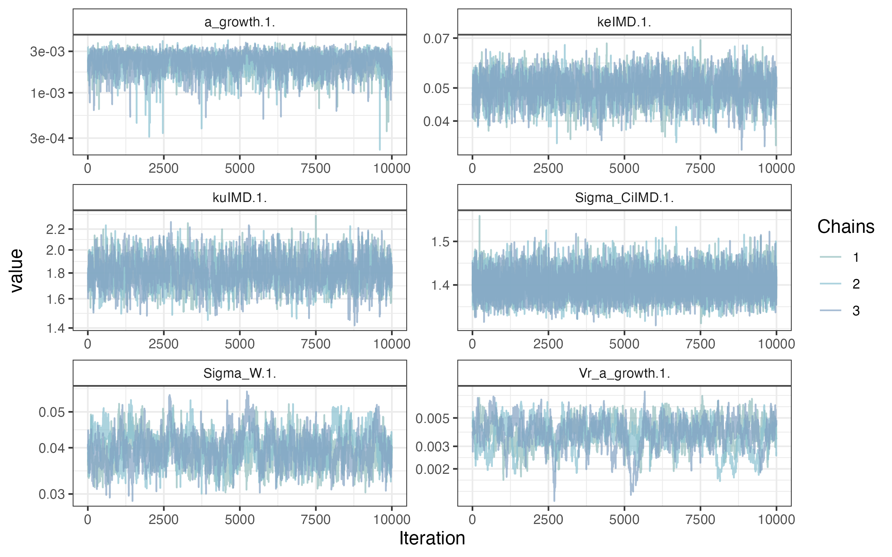

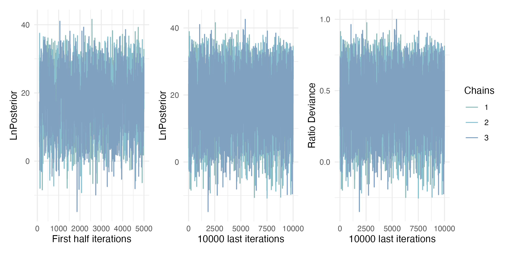

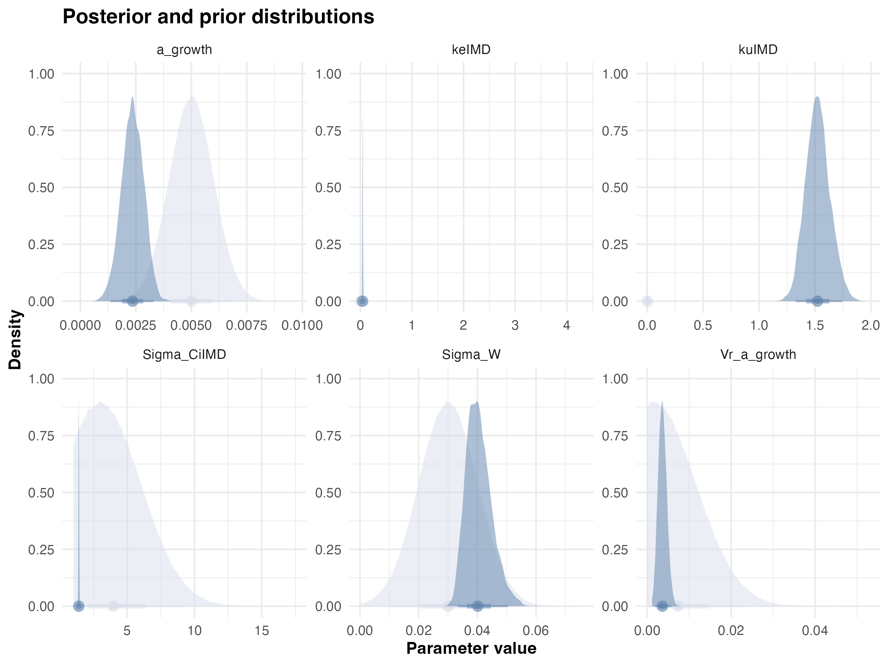

| Statistic | $k_u$ | $k_e$ | $a_{\mu}$ | $a_{\sigma}$ | $W_{\sigma}$ | $C_{i,\sigma}$ | BAF |
|-----------|-------|-------|-----------|--------------|--------------|----------------|-----|
| Mode      | 1.6   | 0.045 | 0.0033    | 0.0013       | 0.053        | 1.4            | 34  |
| Q2.5%     | 1.3   | 0.036 | 0.0014    | 0.0018       | 0.033        | 1.4            | 31  |
| Q97.5%    | 1.7   | 0.053 | 0.0033    | 0.0057       | 0.05         | 1.5            | 39  |

{fig-scap="Predicted versus observed values of internal concentrations."}

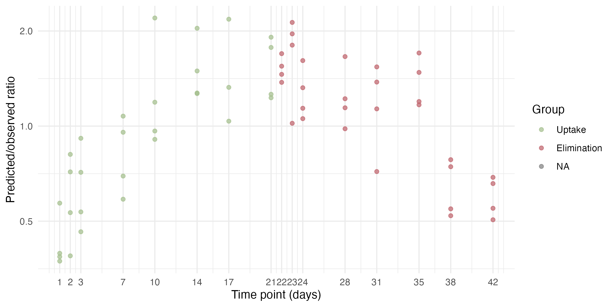

{fig-scap="Estimated toxicokinetic of the IMD concentration in earthworms exposed to 1000 ng/g of IMD."}

{fig-scap="Estimated toxicokinetic of the IMD concentration in earthworms exposed to 1000 ng/g of IMD."}

### Model C1N

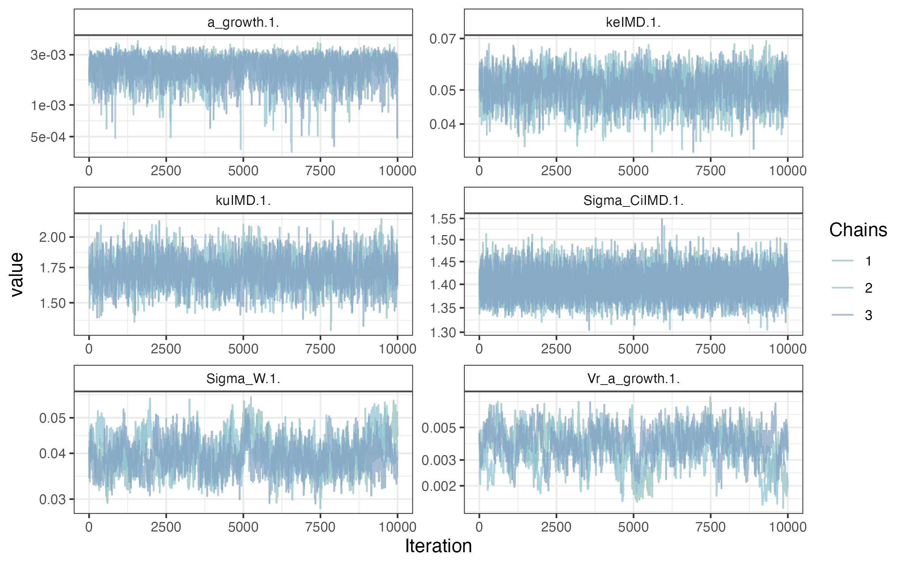

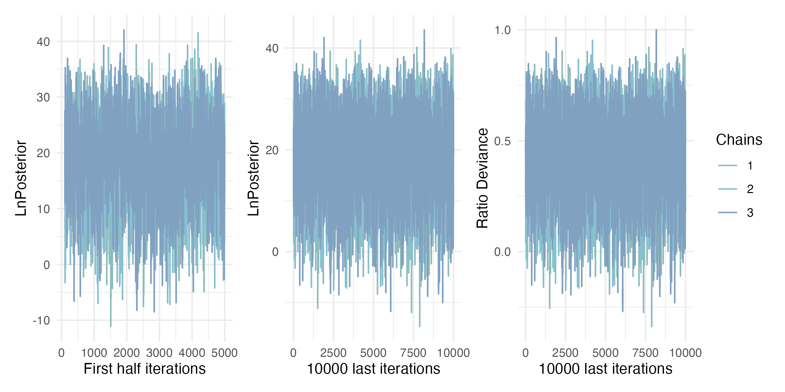

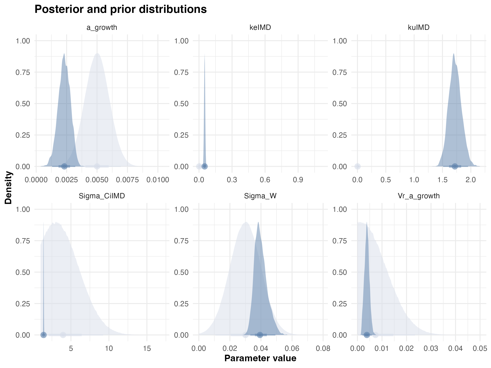

| Statistic | $k_u$ | $k_e$ | $a_{\mu}$ | $a_{\sigma}$ | $W_{\sigma}$ | $C_{i,\sigma}$ | BAF |
|-----------|-------|-------|-----------|--------------|--------------|----------------|-----|
| Mode      | 1.5   | 0.047 | 0.0031    | 0.0014       | 0.048        | 1.4            | 30  |
| Q2.5%     | 1.3   | 0.037 | 0.0013    | 0.0019       | 0.033        | 1.3            | 29  |
| Q97.5%    | 1.6   | 0.054 | 0.0033    | 0.0059       | 0.05         | 1.5            | 36  |

{fig-scap="Predicted versus observed values of internal concentrations."}

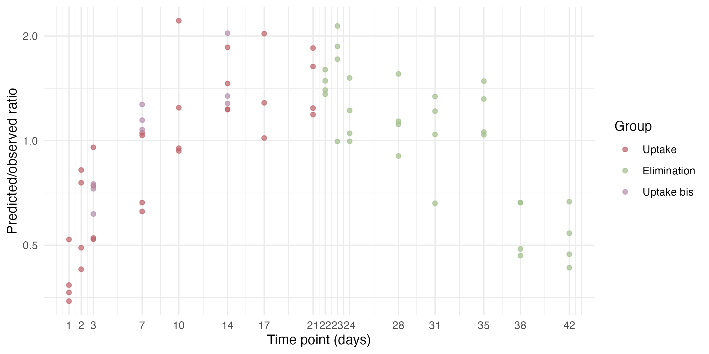

{fig-scap="Estimated toxicokinetic of the IMD concentration in earthworms exposed to 1000 ng/g of IMD."}

{fig-scap="Estimated toxicokinetic of the IMD concentration in earthworms exposed to 1000 ng/g of IMD."}

### Model C2

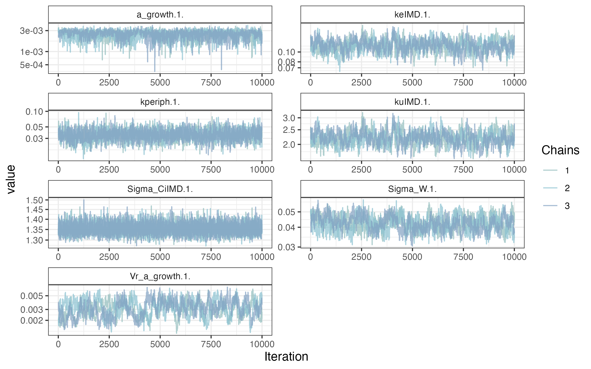

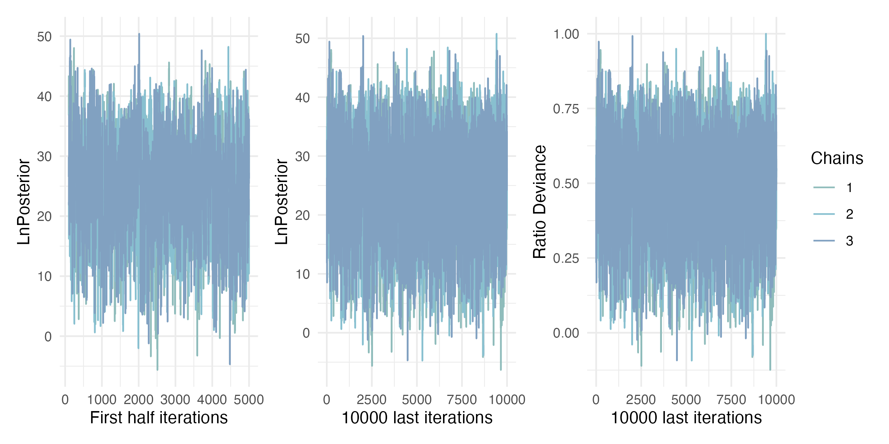

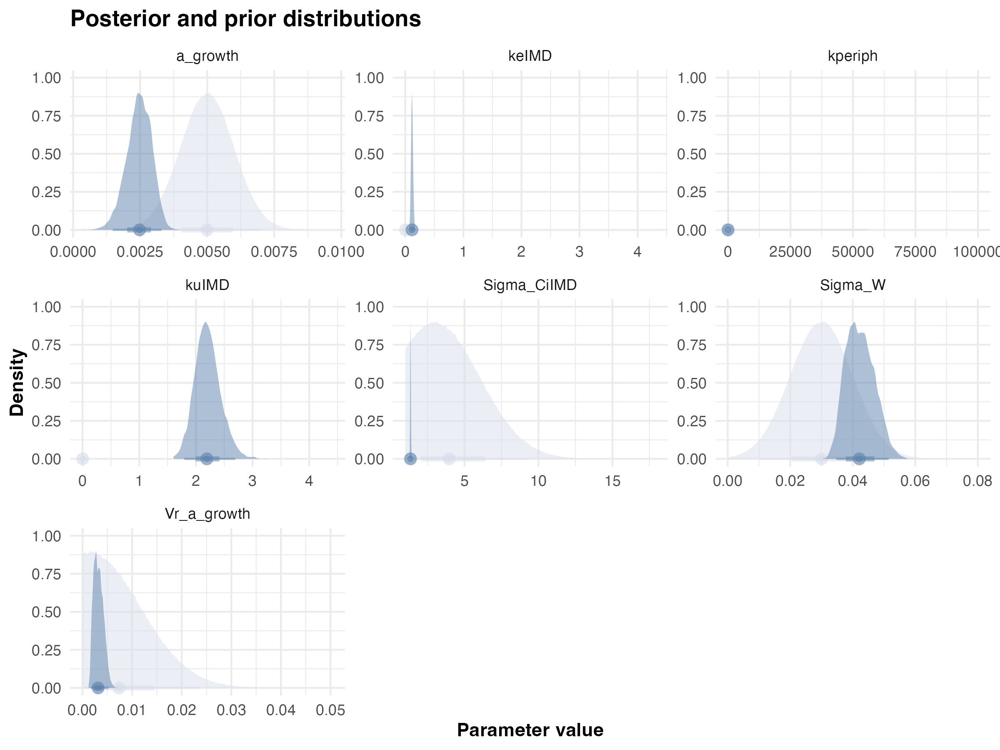

| Statistic | $k_u$ | $k_e$ | $k_{periph}$ | $a_{\mu}$ | $a_{\sigma}$ | $W_{\sigma}$ | $C_{i,\sigma}$ | BAF |
|----|----|----|----|----|----|----|----|----|
| Mode | 2.2 | 0.13 | 0.044 | 0.0031 | 0.0014 | 0.049 | 1.3 | 20 |
| Q2.5% | 1.8 | 0.087 | 0.021 | 0.0015 | 0.0017 | 0.035 | 1.3 | 17 |
| Q97.5% | 2.7 | 0.15 | 0.054 | 0.0033 | 0.0052 | 0.051 | 1.4 | 22 |

{fig-scap="Predicted versus observed values of internal concentrations."}

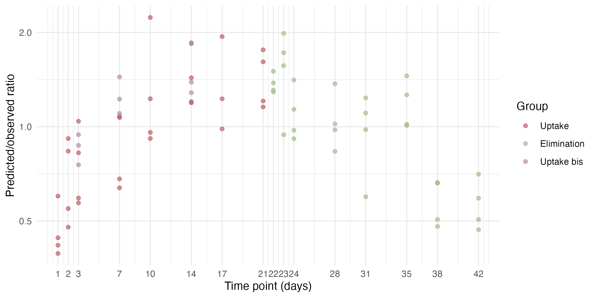

{fig-scap="Estimated toxicokinetic of the IMD concentration in earthworms exposed to 1000 ng/g of IMD."}

{fig-scap="Estimated toxicokinetic of the IMD concentration in earthworms exposed to 1000 ng/g of IMD."}

### Model C2N

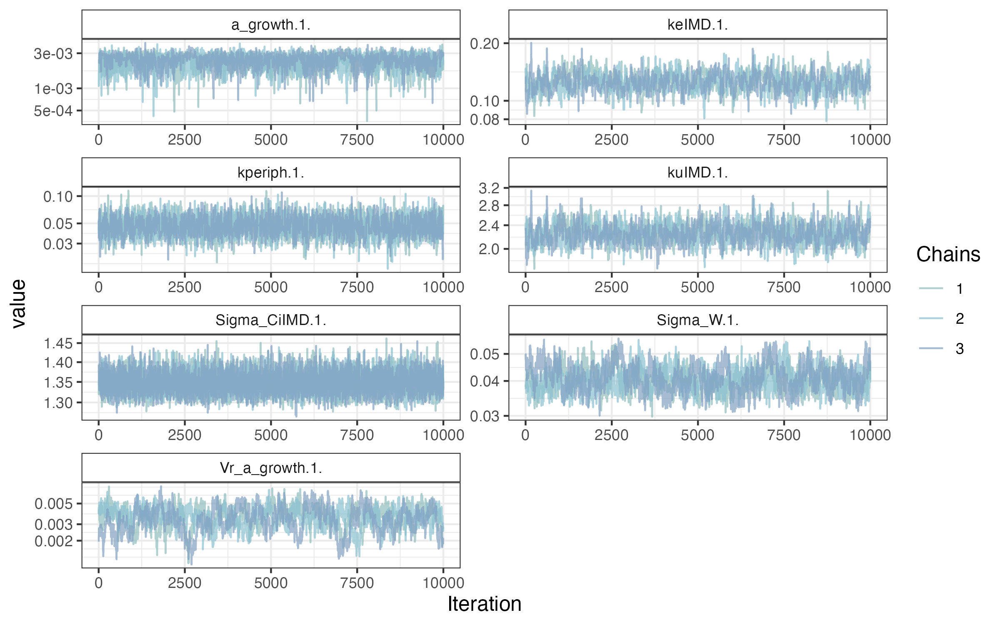

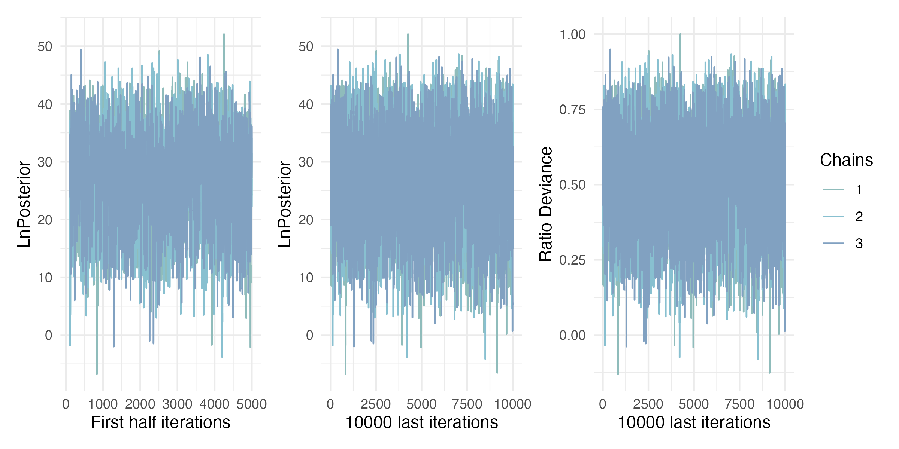

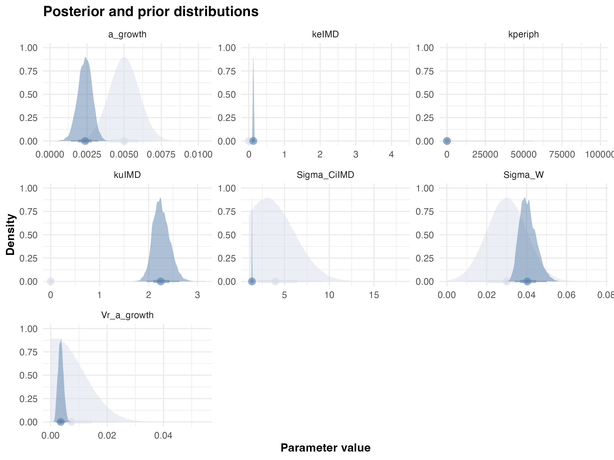

| Statistic | $k_u$ | $k_e$ | $k_{periph}$ | $a_{\mu}$ | $a_{\sigma}$ | $W_{\sigma}$ | $C_{i,\sigma}$ | BAF |
|----|----|----|----|----|----|----|----|----|
| Mode | 1.9 | 0.12 | 0.033 | 0.0031 | 0.0014 | 0.048 | 1.4 | 20 |
| Q2.5% | 1.6 | 0.084 | 0.024 | 0.0014 | 0.0018 | 0.034 | 1.3 | 15 |
| Q97.5% | 2.2 | 0.14 | 0.064 | 0.0032 | 0.0056 | 0.051 | 1.4 | 20 |

{fig-scap="Predicted versus observed values of internal concentrations."}

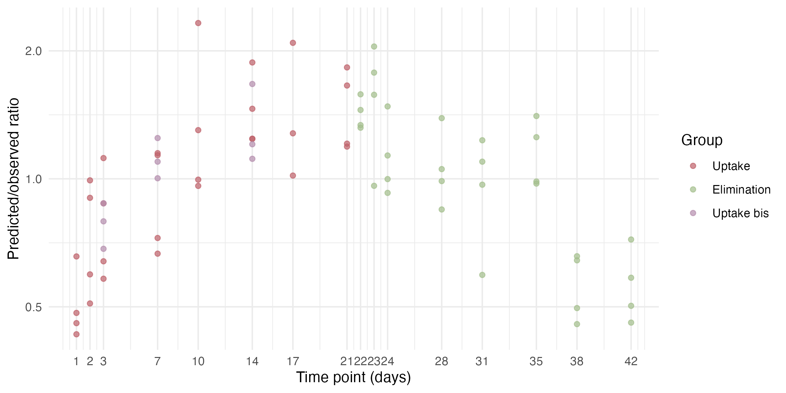

{fig-scap="Estimated toxicokinetic of the IMD concentration in earthworms exposed to 1000 ng/g of IMD."}

{fig-scap="Estimated toxicokinetic of the IMD concentration in earthworms exposed to 1000 ng/g of IMD."}

## Epoxiconazole

### Model C1

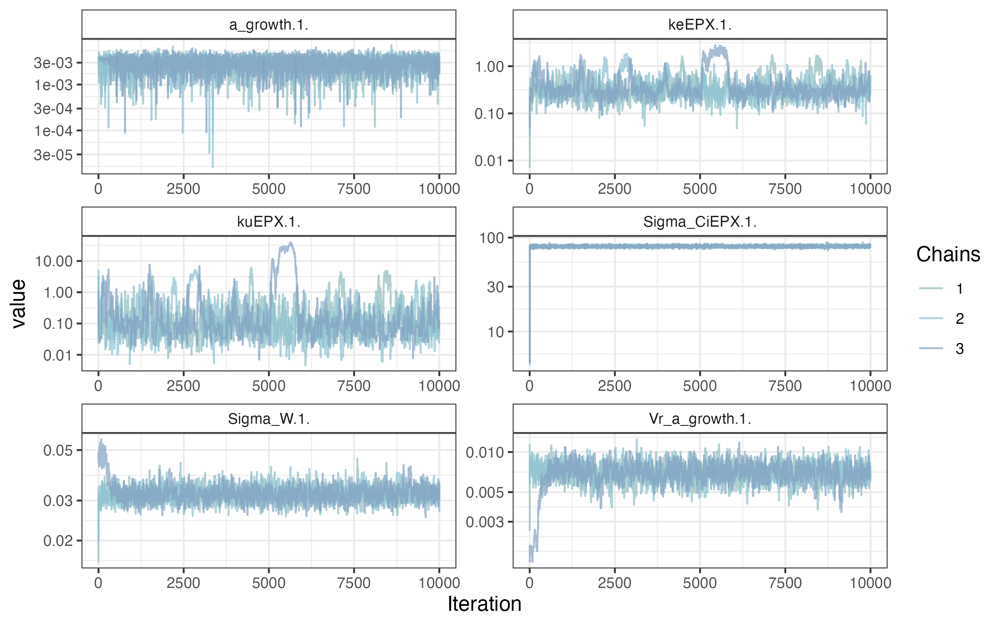

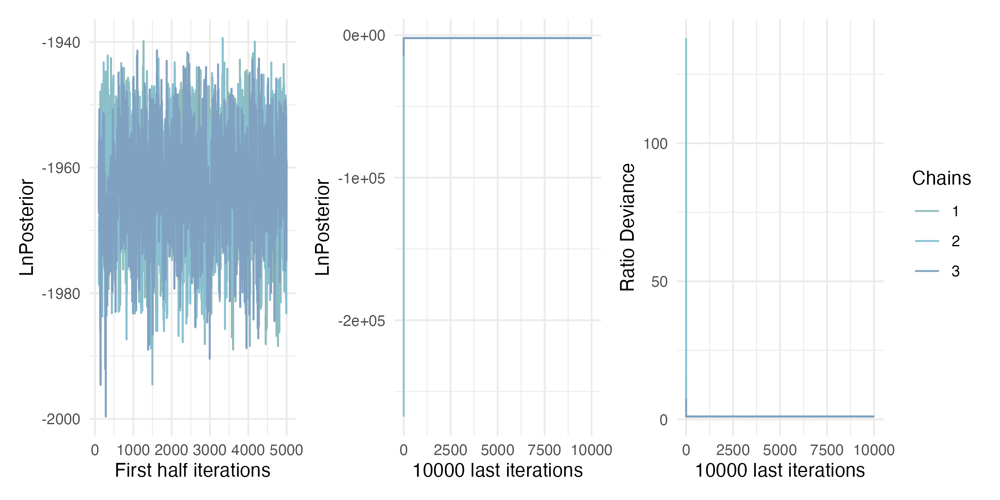

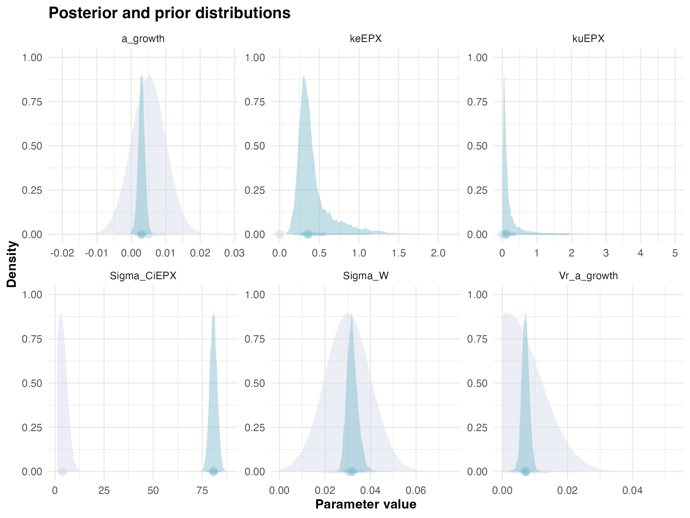

| Statistic | $k_u$ | $k_e$ | $a_{\mu}$ | $a_{\sigma}$ | $W_{\sigma}$ | $C_{i,\sigma}$ | BAF   |
|-----------|-------|-------|-----------|--------------|--------------|----------------|-------|
| Mode      | 0.088 | 0.3   | 0.0017    | 0.0074       | 0.031        | 79             | 0.18  |
| Q2.5%     | 0.018 | 0.16  | 0.0011    | 0.0048       | 0.028        | 77             | 0.084 |
| Q97.5%    | 4.6   | 1.4   | 0.0047    | 0.0092       | 0.038        | 84             | 3.7   |

{fig-scap="Predicted versus observed values of internal concentrations."}

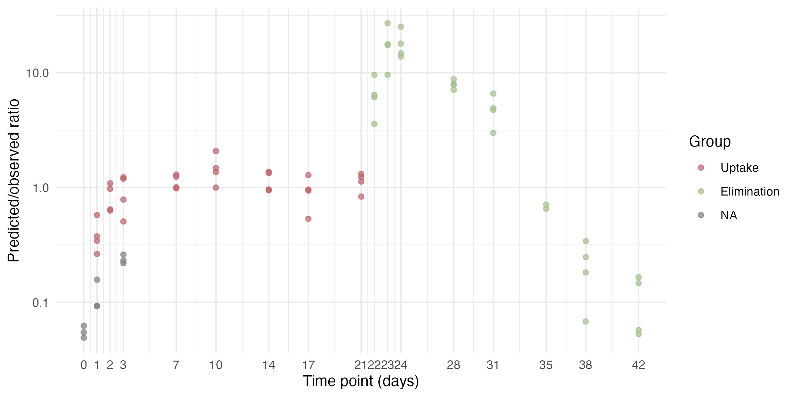

{fig-scap="Estimated toxicokinetic of the EPX concentration in earthworms exposed to 1000 ng/g of EPX."}

{fig-scap="Estimated toxicokinetic of the EPX concentration in earthworms exposed to 1000 ng/g of EPX."}

### Model C1P

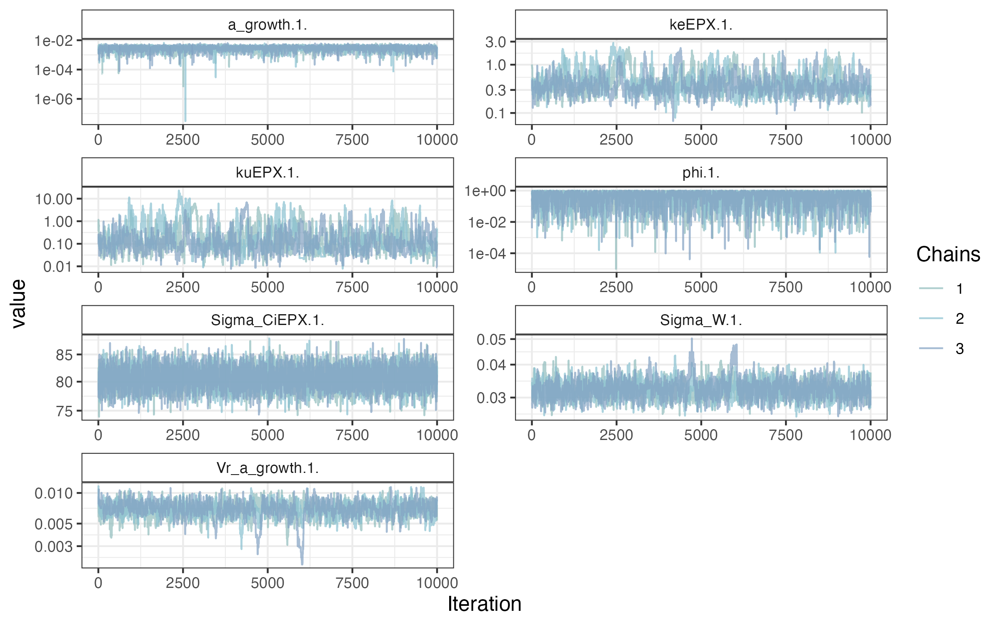

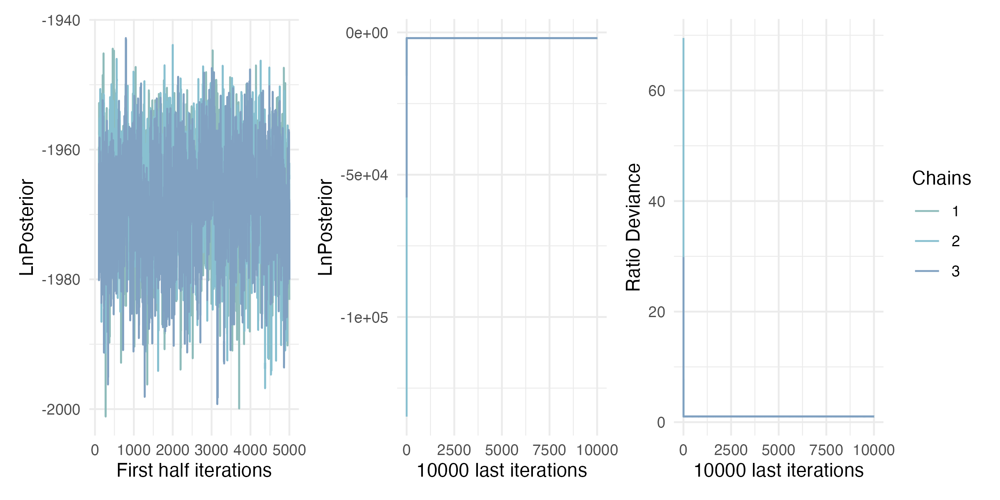

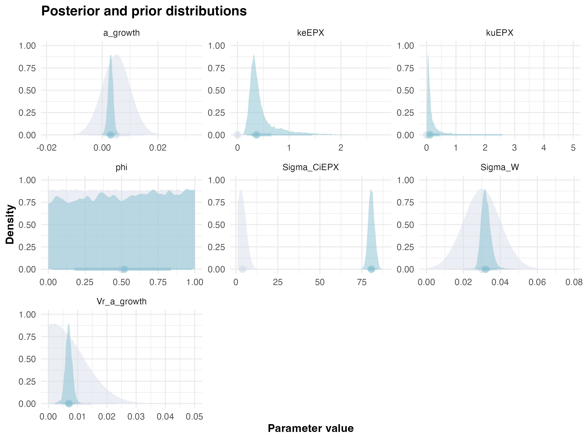

| Statistic | $k_u$ | $k_e$ | $\phi$ | $a_{\mu}$ | $a_{\sigma}$ | $W_{\sigma}$ | $C_{i,\sigma}$ | BAF |
|----|----|----|----|----|----|----|----|----|
| Mode | 0.048 | 0.25 | 0.95 | 0.0023 | 0.0066 | 0.029 | 79 | 0.19 |
| Q2.5% | 0.015 | 0.15 | 0.028 | 0.0012 | 0.0044 | 0.028 | 77 | 0.077 |
| Q97.5% | 2.3 | 1.1 | 0.98 | 0.0047 | 0.0093 | 0.039 | 84 | 2.2 |

{fig-scap="Predicted versus observed values of internal concentrations."}

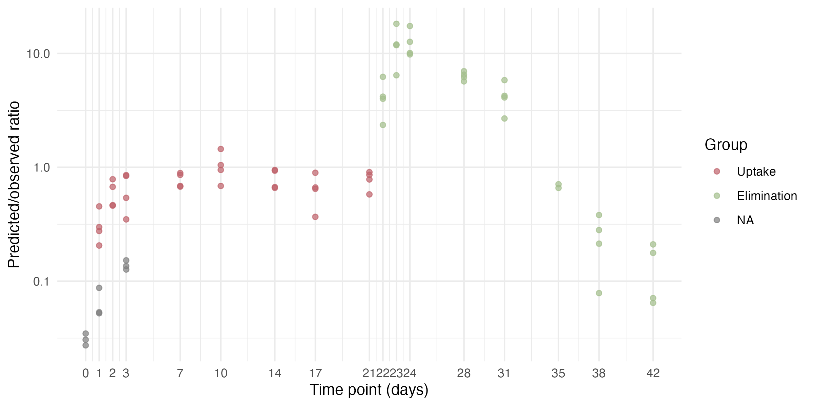

{fig-scap="Estimated toxicokinetic of the EPX concentration in earthworms exposed to 1000 ng/g of EPX."}

{fig-scap="Estimated toxicokinetic of the EPX concentration in earthworms exposed to 1000 ng/g of EPX."}

### Model C2

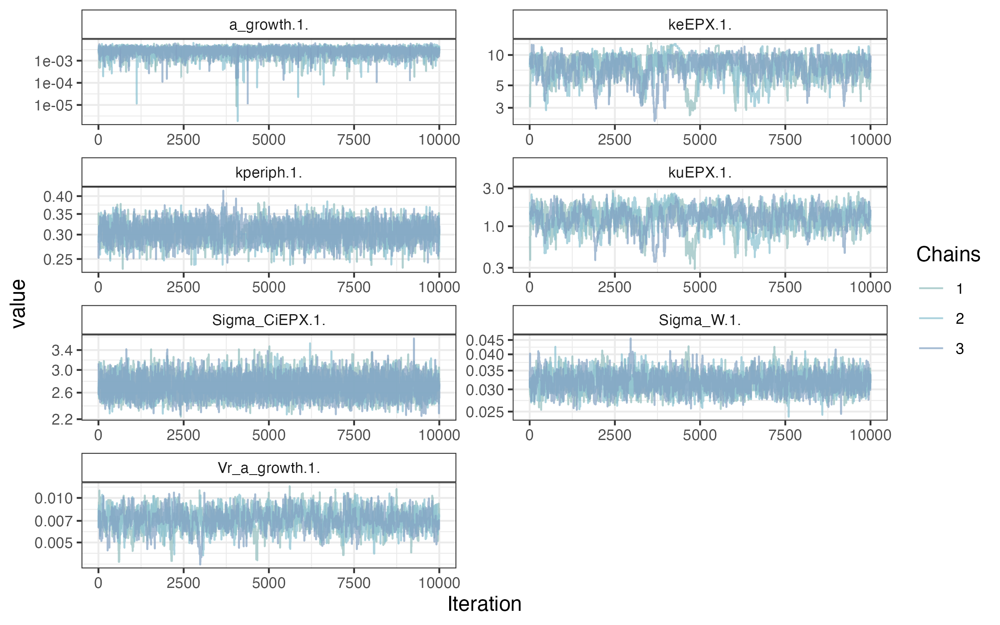

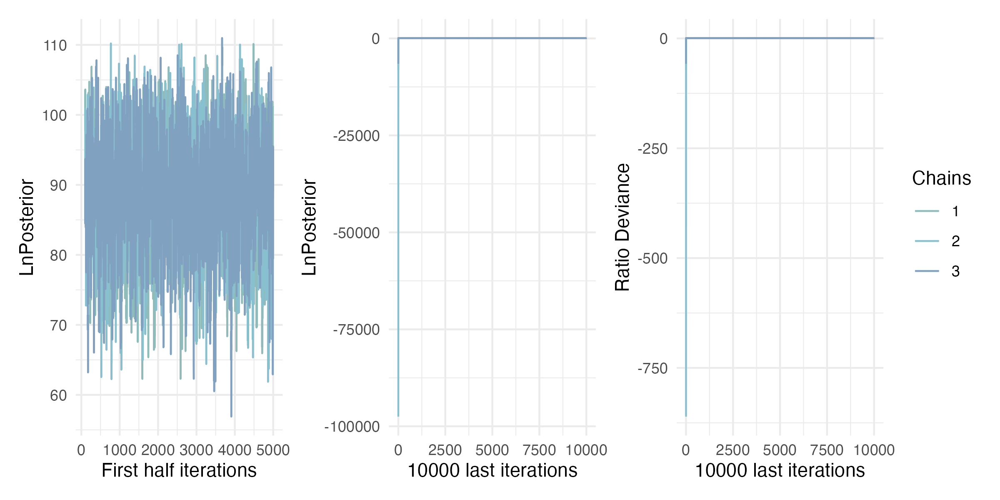

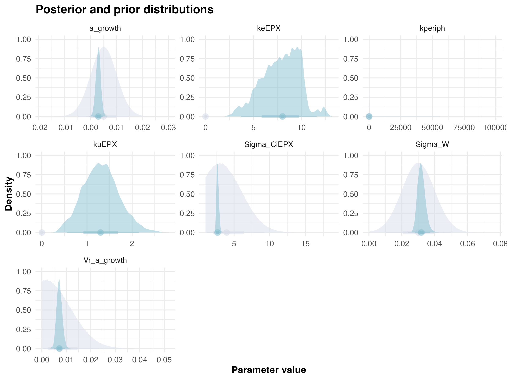

| Statistic | $k_u$ | $k_e$ | $k_{periph}$ | $a_{\mu}$ | $a_{\sigma}$ | $W_{\sigma}$ | $C_{i,\sigma}$ | BAF |
|----|----|----|----|----|----|----|----|----|
| Mode | 0.082 | 5.4 | 0.26 | 0.0026 | 0.006 | 0.029 | 2.8 | 0.18 |
| Q2.5% | 0.039 | 2.7 | 0.23 | 0.001 | 0.0047 | 0.028 | 2.5 | 0.12 |
| Q97.5% | 1.7 | 8.9 | 0.3 | 0.0048 | 0.0094 | 0.038 | 3.1 | 0.21 |

{fig-scap="Predicted versus observed values of internal concentrations."}

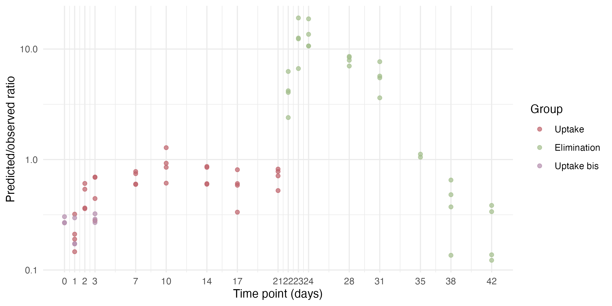

{fig-scap="Estimated toxicokinetic of the EPX concentration in earthworms exposed to 1000 ng/g of EPX."}

{fig-scap="Estimated toxicokinetic of the EPX concentration in earthworms exposed to 1000 ng/g of EPX."}

### Model C2P

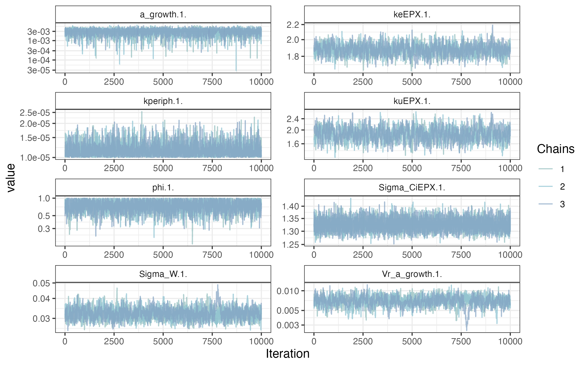

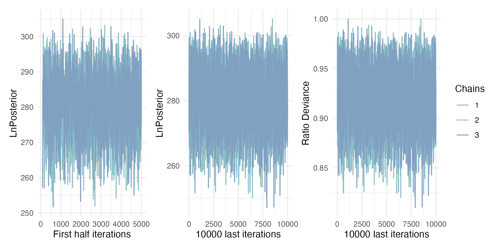

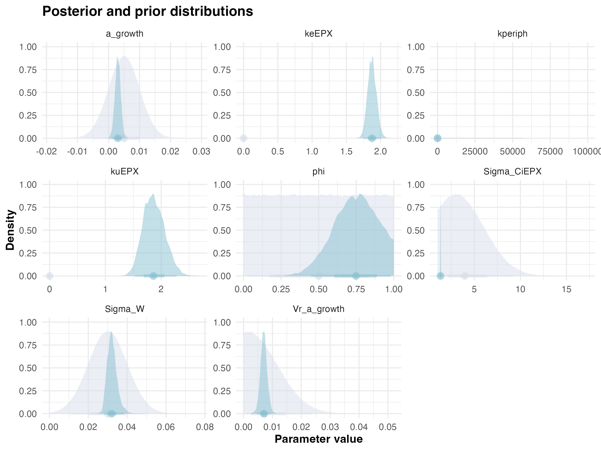

| Statistic | $k_u$ | $k_e$ | $k_{periph}$ | $\phi$ | $a_{\mu}$ | $a_{\sigma}$ | $W_{\sigma}$ | $C_{i,\sigma}$ | BAF |
|----|----|----|----|----|----|----|----|----|----|
| Mode | 1.6 | 1.7 | 3.1e-8 | 0.91 | 0.0041 | 0.0015 | 0.048 | 1.3 | 0.9 |
| Q2.5% | 1.4 | 1.6 | 1.1e-8 | 0.63 | 0.0011 | 0.0025 | 0.028 | 1.3 | 0.88 |
| Q97.5% | 2 | 1.8 | 1.6e-7 | 0.99 | 0.0047 | 0.0093 | 0.044 | 1.3 | 1.1 |

{fig-scap="Predicted versus observed values of internal concentrations."}

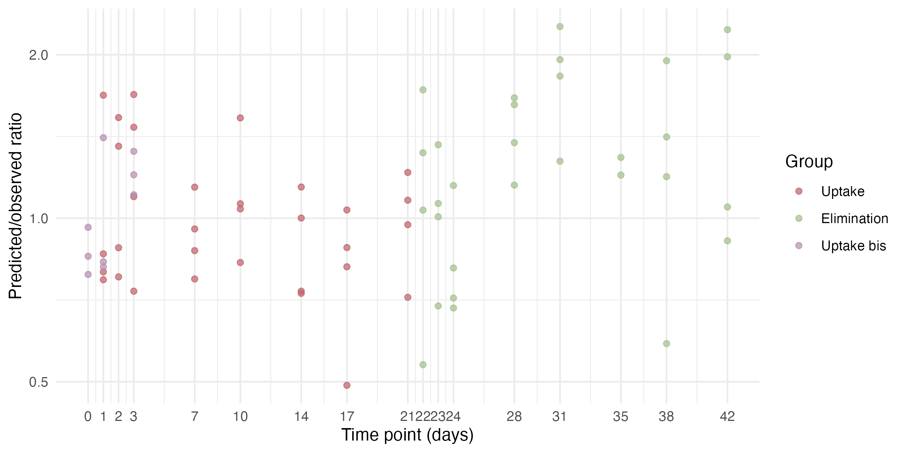

{fig-scap="Estimated toxicokinetic of the EPX concentration in earthworms exposed to 1000 ng/g of EPX."}

{fig-scap="Estimated toxicokinetic of the EPX concentration in earthworms exposed to 1000 ng/g of EPX."}

# References {.unnumbered}

::: {#refs}
:::
